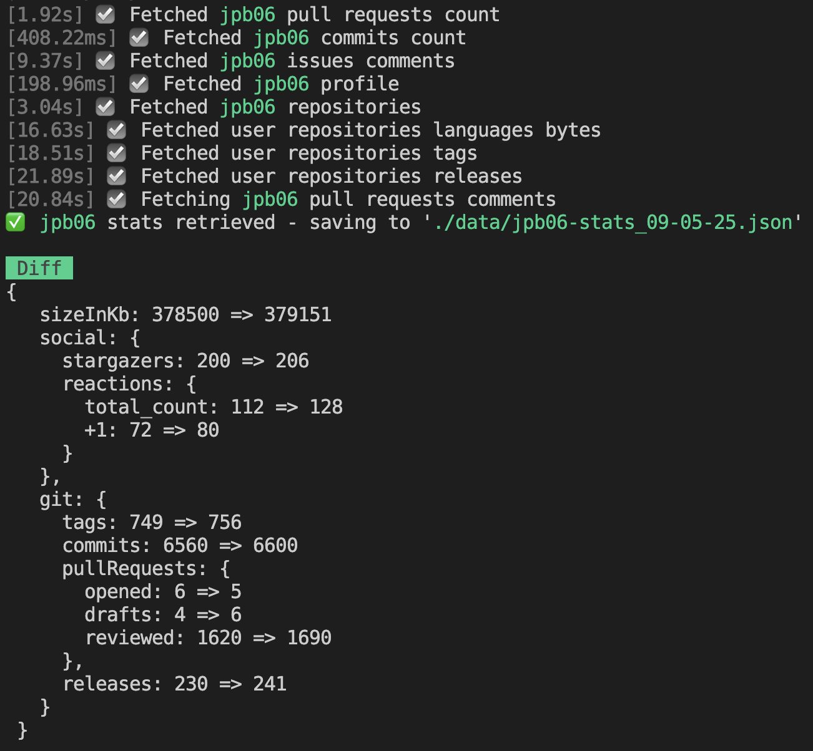

# github-profile-stats

[](https://github.dev/jpb06/github-profile-stats)

Fetching user activity on github using an effect layer relying on octokit.

<!-- readme-package-icons start -->

<p align="left"><a href="https://www.typescriptlang.org/docs/" target="_blank"></a>&nbsp;<a href="https://nodejs.org/en/docs/" target="_blank"></a>&nbsp;<a href="https://bun.sh/docs" target="_blank"></a>&nbsp;<a href="https://biomejs.dev/guides/getting-started/" target="_blank"></a>&nbsp;<a href="https://www.effect.website/docs/quickstart" target="_blank"></a></p>

<!-- readme-package-icons end -->



## ⚡ Output type

```ts
type Topic = { name: string; count: number };

type LanguagesBytes = Record<string, number>;

type Reactions = {
  total_count: number;
  '+1': number;
  '-1': number;
  laugh: number;
  confused: number;
  heart: number;
  hooray: number;
  eyes: number;
  rocket: number;
};

export type GithubUserStats = {
  name: string | null;
  onGithubSince: string;
  location: string | null;
  company: string | null;
  sizeInKb: number;
  bytesByLanguage: LanguagesBytes;
  social: {
    orgs: number;
    following: number;
    followers: number;
    stargazers: number;
    watchers: number;
    reactions: Reactions;
    comments: number;
  };
  git: {
    publicRepos: number;
    publicGists: number;
    forks: number;
    tags: number;
    commits: number;
    issues: {
      opened: number;
      closed: number;
    };
    pullRequests: {
      opened: number;
      reviewed: number;
      drafts: number;
      closed: number;
      merged: number;
    };
    releases: number;
  };
  topics: Topic[];
};
```

## ⚡ Env

```bash
GITHUB_TOKEN="xxx"
```

## ⚡ Install dependencies

```bash
bun install
```

## ⚡ Run script

```bash
bun dev
```
